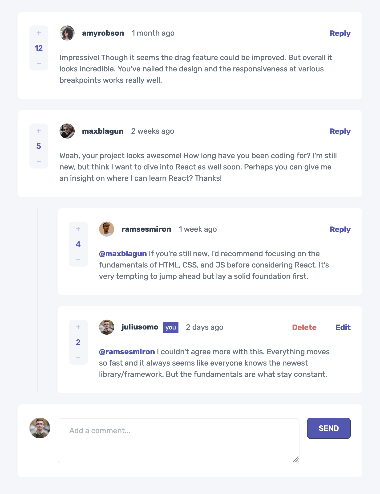

Interactive Comments Section Solution

This is a solution to the [Interactive Comments Section on Frontend Mentor](https://www.frontendmentor.io/challenges/interactive-comments-section-iG1RugEG9). Frontend Mentor challenges help you improve your coding skills by building realistic projects. 

## Table of Contents

- [Overview](#overview)
  - [The challenge](#the-challenge)
  - [Screenshot](#screenshot)
  - [Links](#links)
- [My process](#my-process)
  - [Built with](#built-with)
  - [What I learned](#what-i-learned)
  - [Continued development](#continued-development)
- [Author](#author)

## Overview

### The Challenge

Users should be able to:

- View the optimal layout for the app depending on their device's screen size
- See hover states for all interactive elements on the page
- Create, Read, Update, and Delete comments and replies
- **Bonus**: If you're building a purely front-end project, use `localStorage` to save the current state in the browser that persists when the browser is refreshed. _(optional)_

### Screenshot

### Links

- Solution URL: 
- Live Site URL: [https://nisenihonjin.github.io/interactive-comments-section/](https://nisenihonjin.github.io/interactive-comments-section/)

## My Process

### Built With

- Semantic HTML5 markup
- CSS custom properties
- CSS Grid / Flex Layout
- Mobile-first workflow
- [Vue 3](https://v3.vuejs.org/) - A progressive framework for building user interfaces in JavaScript

### What I Learned

In this challenge, depending on screen resolution, certain comment elements would shift from top to bottom along with horizontal vs. vertical display, so I wanted to try using a mixture of `grid` and `flexbox` in my layouts as to not have to worry so much about the order of my elements in the HTML. I used simple CSS as I didn't feel the need for extra complexity with SASS or a framework was necessary due to the simple design.

I tweeked the initial data to be more "database" like; instead of each comment having a nested `replies` property within the JSON, I simply gave each comment a `parentId` property to link it with any potential parent comments. That way there won't be nests within nests of comment threads. Granted, the starting data doesn't let you go beyond two nestings deep do to the initial users' comments, the possibility is there.

I also altered the `createdAt` property so it represents the number of milliseconds before "now", so if there is no data in `localStorage` it will reflect the same time elapsed in the challenge's mockup. Of course, once saved to `localStorage` the time will update accordingly.

### Continued Development

One thing I wish I did more was in regard to animations. New comments, updating, and deleting currently just pop right in. Also, I didn't pay much attention to implementing accessibility features. It'd also be nice to convert this into TypeScript.

## Author

- Website - [Aaron Romanick](https://www.aaronromanick.com)
- Frontend Mentor - [@nisenihonjin](https://www.frontendmentor.io/profile/nisenihonjin)